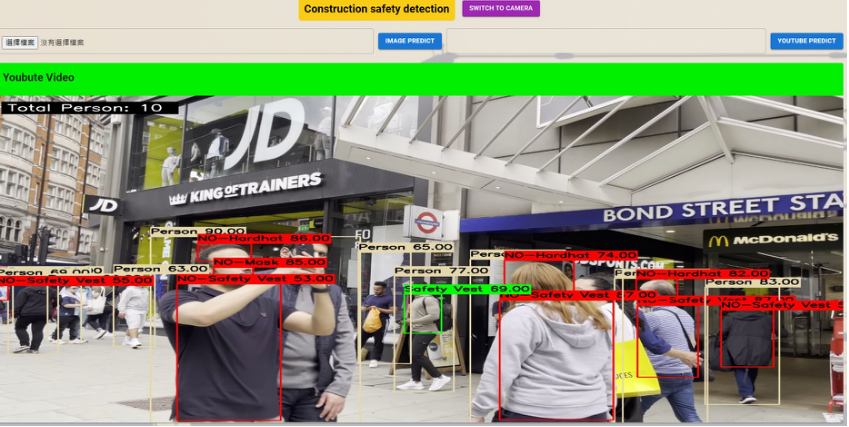
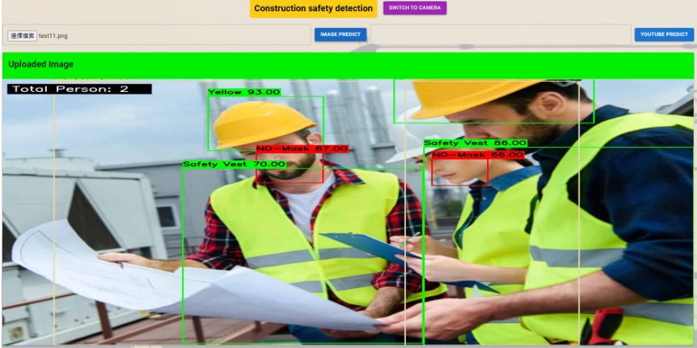
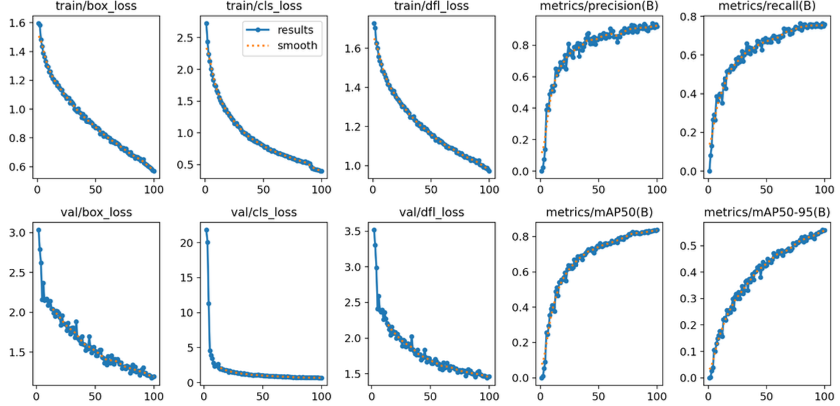

# 🏗️ Construction Safety Detection

A web application for real-time construction site safety monitoring using YOLOv9 and K-Nearest Neighbors (KNN). This system detects whether workers are wearing proper safety gear and identifies their roles based on helmet color.

## 📌 Project Overview

This application is developed as an individual project for ITE3905 (EA Assignment) and aims to:

- Detect 14 safety-related classes (e.g., hardhats, masks, vests, machinery, vehicles)
- Classify helmet colors to infer roles on the construction site
- Support live detection from webcam and YouTube videos

## 🧠 Technologies Used

### 🖼️ Model 1: YOLOv9
- **Purpose**: Real-time object detection
- **Classes**: `Hardhat`, `Mask`, `NO-Hardhat`, `NO-Mask`, `NO-Safety Vest`, `Person`, `Safety Cone`, `SafetyVest`, `Machinery`, `Vehicle`
- **Training**:
  - 100 epochs
  - Batch size: 32
  - Optimizer: AdamW
  - Duration: ~12 hours
- **Dataset**: [Construction Site Safety Dataset (Roboflow)](https://universe.roboflow.com/roboflow-universe-projects/construction-site-safety) (~150MB, 2801 images)

### 🎨 Model 2: KNN
- **Purpose**: Helmet color classification
- **Classes**: `helmet_blue`, `helmet_orange`, `helmet_white`, `helmet_yellow`
- **Training**:
  - `train_test_split` with 80/20 split
  - `n_neighbors=5`
  - `random_state=42`
- **Dataset**: [Helmet Color Dataset (Roboflow)](https://universe.roboflow.com/dwei/color-2ypdo) (~25.1MB after preprocessing)

## ⚙️ System Architecture

### 🔧 Backend (Inference Server)
- **Flask**: Handles model deployment and real-time inference
- **OpenCV**: Captures video from local webcam
- **VidGear**: Supports YouTube video source input

### 🖥️ Frontend (Client Side)
- **React**: Provides a responsive UI with real-time updates

## 🧪 Features

- 👷 Detects presence or absence of safety equipment
- 🟦 Helmet color-based role classification
- 📸 Supports live camera and YouTube input
- 🖼️ Still image detection mode

## ✅ Pros

- **YOLOv9**
  - High performance and accuracy
  - Real-time inference
  - Lightweight with fewer parameters

- **KNN**
  - Simple and efficient
  - Low resource requirements

## ⚠️ Cons

- **YOLOv9**
  - Requires capable hardware due to ~25.3M parameters

- **KNN**
  - Sensitive to noise and irrelevant features
  - Lower accuracy compared to deep models
 

## 🖼️ UI Showcase - Partial

Here are some screenshots demonstrating the Yummy Restaurant System's interfaces:

###  Youtube sorce detection


###  Image Source


## 🖼️ Model Evaluation

###  Traning evalute


###  Confusion matrix


## 🚀 Getting Started

### 1. Clone the Repository
```bash
git clone https://github.com/HinsJai/ITE3905_AI.git
cd ITE3905_AI
```

### 2. Setup Environment

Install Python dependencies:

```bash
pip install -r requirements.txt
```

Make sure to install:
- Flask
- OpenCV
- VidGear
- Scikit-learn
- YOLOv9 dependencies

### 3. Run the Backend
```bash
python app.py
```

### 4. Run the Frontend
From the `client` directory:

```bash
npm install
npm start
```

## 📂 Dataset Links

- 🔗 [YOLOv9 Dataset](https://universe.roboflow.com/roboflow-universe-projects/construction-site-safety)
- 🔗 [Helmet Color Dataset](https://universe.roboflow.com/dwei/color-2ypdo)

## 📄 License

This project is developed as an academic submission and is not licensed for commercial use. Please contact the author for inquiries.
